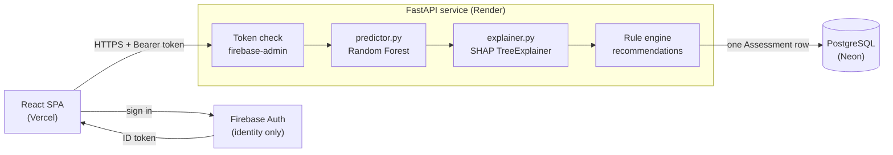
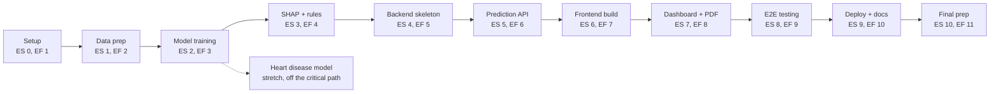

# HealthLens

HealthLens is a web app that screens for Type 2 diabetes and cardiovascular disease risk and explains every result it gives. You answer a short health questionnaire, a trained Random Forest returns a risk score, SHAP shows which of your answers moved that score, and a small rule engine turns the risky factors into diet, exercise and specialist advice.

We built it as our CSE474 (Software Development and Project Management Lab) project at Southeast University, Summer 2026.


**Live app:** https://healthlens-red.vercel.app
**API docs (Swagger):** https://healthlens-backend-ewuw.onrender.com/docs

> **Medical disclaimer.** HealthLens is a preliminary screening tool. It does not diagnose any condition and it is not a substitute for a doctor. Every result the app shows carries this disclaimer.

> **First request can be slow.** The backend runs on Render's free tier, which puts the server to sleep when nobody is using it. The first request after a quiet period can take 50 seconds or more while it wakes up. After that, responses are normal.

---

## Contents

1. [What HealthLens does](#what-healthlens-does)
2. [Why we built it](#why-we-built-it)
3. [How a request moves through the system](#how-a-request-moves-through-the-system)
4. [The models](#the-models)
5. [Explanations and recommendations](#explanations-and-recommendations)
6. [Tech stack](#tech-stack)
7. [API reference](#api-reference)
8. [Project structure](#project-structure)
9. [Running it locally](#running-it-locally)
10. [Deployment](#deployment)
11. [Testing](#testing)
12. [Project management](#project-management)
13. [Team and contributions](#team-and-contributions)
14. [Known limitations](#known-limitations)
15. [Roadmap](#roadmap)
16. [Datasets and acknowledgements](#datasets-and-acknowledgements)

---

## What HealthLens does

After signing up with an email and password, a user picks a condition (diabetes or heart disease) and fills in one questionnaire. The two conditions share the same form, so most answers carry over, and the heart disease screening only adds two questions of its own: chest pain type and whether exercise brings on angina.

The result page shows four things together:

- a risk score between 0 and 1, labelled low (up to 0.33), moderate (up to 0.66) or high;
- the four answers that pushed the score up or down the most, with the direction of each, calculated by SHAP;
- diet and exercise advice tied to the factors that are raising the risk, plus a specialist suggestion and an urgency note based on the risk label;
- the medical disclaimer.

Every assessment is saved. The dashboard charts a user's risk scores over time, and any result can be downloaded as a PDF report.

## Why we built it

Type 2 diabetes and heart disease are often found late, after symptoms appear, when treatment is harder and more expensive. The free risk checkers people find online usually return a single number and give no reason for it, so the user has nothing to act on.

We had working-age adults in Bangladesh in mind, many of whom don't get routine preventive checkups. Community health workers doing outreach screening were our second group. For both, knowing *why* a score is high matters as much as the score itself, so every result comes with its explanation.

---

## How a request moves through the system



Firebase owns identity from start to finish. Sign-up and sign-in go from the browser straight to Firebase, so our backend never sees or stores a password. What happens when a user submits the questionnaire:

1. The Axios client in `frontend/src/api/client.js` attaches a fresh Firebase ID token to the request through an interceptor. `getIdToken()` refreshes the token on its own when it is close to expiring.
2. `POST /api/v1/assessments` reaches the `get_current_user` dependency in `core/firebase_auth.py`, which verifies the token against Firebase's public signing certificates. The `firebase-admin` SDK caches those certificates, so there is no network call to Firebase on each request.
3. `get_current_db_user` in `api/deps.py` maps the verified Firebase `uid` to a local `User` row. That row is created once, right after sign-in, by `POST /auth/sync`, which lets assessments use an ordinary foreign key.
4. `predictor.py` loads the trained model for the chosen condition, builds the exact feature row the model was trained on and returns a risk score.
5. `explainer.py` runs SHAP's `TreeExplainer` on that same row and returns the top four factors ranked by absolute impact.
6. `recommendations/engine.py` turns the qualifying factors into advice (details below).
7. Score, label, factors, advice and disclaimer are saved as a single `Assessment` row, with JSON columns for the parts whose shape varies, and returned to the browser.
8. The frontend opens `/results/:id` straight from that response. A refresh or a shared link fetches the same result again through `GET /history/{id}`.

---

## The models

We trained two independent binary classifiers with the same pipeline. Both notebooks in `ml-notebooks/` were run from start to finish, and their outputs are saved in the notebooks.

### Diabetes

| | |
|---|---|
| Dataset | Pima Indians Diabetes Dataset, 768 records (`data/raw/pima_diabetes.csv`) |
| Population | Women aged 21 and over, all of Pima Indian heritage |
| Features used (5 of 8) | `pregnancies`, `glucose`, `diastolic_bp`, `bmi`, `age` |
| Features left out | `SkinThickness` and `Insulin` need a caliper measurement or a lab test that most people screening themselves won't have, and they are the least reliable columns in the dataset. `DiabetesPedigreeFunction` is a composite genetic score nobody can self-report, so we ask a simple family-history question instead and use it for recommendations only. |

| Model | CV ROC-AUC | Test ROC-AUC | Test accuracy | Precision | Recall | F1 |
|---|---|---|---|---|---|---|
| Logistic Regression | 0.8405 | 0.8037 | 0.7143 | 0.600 | 0.556 | 0.577 |
| **Random Forest (chosen)** | **0.8328** | **0.8196** | **0.7468** | **0.667** | **0.556** | **0.606** |
| XGBoost | 0.8148 | 0.8172 | 0.7532 | 0.660 | 0.611 | 0.635 |

XGBoost edged ahead on test accuracy and F1, so this choice needs a reason. We selected on ROC-AUC because the classes are imbalanced and the test set is small, which makes accuracy swing on one or two patients. Random Forest had the best test ROC-AUC and the smallest gap between cross-validation and test (0.833 against 0.820). Logistic Regression scored highest in cross-validation but dropped to 0.804 on the test set.

### Heart disease

| | |
|---|---|
| Dataset | UCI Heart Disease, Cleveland Clinic subset, 303 records (fetched by `ml-notebooks/download_heart_data.py`, not committed) |
| Population | One clinic, collected in the 1980s, 68% male, ages 29 to 77 with a mean of 54, patients who already had symptoms |
| Features used (7 of 13) | `age`, `sex`, `chest_pain_type`, `systolic_bp`, `cholesterol_total`, `fbs`, `exercise_angina` |
| Features left out | `restecg`, `thalach`, `oldpeak`, `slope`, `ca`, `thal`. Each one is the output of a cardiac workup (ECG, treadmill stress test, fluoroscopy, thallium scan). HealthLens exists to tell someone whether they need that workup, so asking for its results as input would be circular. |

| Model | CV ROC-AUC | Test ROC-AUC | Test accuracy | Precision | Recall | F1 |
|---|---|---|---|---|---|---|
| Logistic Regression | 0.8264 | 0.8755 | 0.7705 | 0.750 | 0.750 | 0.750 |
| **Random Forest (chosen)** | **0.8342** | **0.8950** | **0.8525** | **0.828** | **0.857** | **0.842** |
| XGBoost | 0.7901 | 0.8506 | 0.7377 | 0.714 | 0.714 | 0.714 |

Random Forest won on every metric here.

Leaving out the workup features had a measured cost, because they are the dataset's strongest predictors (`thal` correlates with the target at r = 0.53 and `ca` at r = 0.46):

| Heart disease model | 5-fold CV ROC-AUC |
|---|---|
| Deployed, 7 self-reportable features | 0.834 |
| Same model with all 13 columns | 0.891 |

We think giving up those five or six points is the right trade for a self-screening tool, but it is a real loss and we report it as one.

`fbs` (fasting blood sugar) is a training column the app never asks about. It is derived from the glucose value already collected for the diabetes form: above 120 mg/dL counts as high.

### How predictions are served

- Both chosen models are saved with `joblib` as raw `RandomForestClassifier` objects in `app/ml/artifacts/{condition}_model.joblib`. We deliberately did not wrap them in a scikit-learn `Pipeline`: tree models need no feature scaling, and `shap.TreeExplainer` needs the raw estimator. Any future model swap has to keep this contract.
- `load_model()` in `predictor.py` is wrapped in `lru_cache`, so each model is read from disk once per server process and then reused from memory.
- `_to_feature_frame()` converts the validated input into the encoding the model was trained on: sex and booleans become 0 or 1, `chest_pain_type` becomes the UCI integer code from 1 to 4, and `fbs` is derived from glucose. Column order is fixed by the `FEATURE_ORDER` dictionary, which must change together with the training notebooks. If the two ever disagree, predictions go wrong without raising any error.

---

## Explanations and recommendations

**SHAP.** SHAP is not a second model. It is a method from cooperative game theory (Shapley values) that splits one prediction among the input features, so each feature gets a signed share of the difference between the model's average output and this user's score. We use `TreeExplainer`, which reads the structure of the trees directly and computes these values quickly. The app shows the four features with the largest absolute impact.

One version bug came up here. Newer `shap` releases return a single 3D array (samples × features × classes) from `TreeExplainer`, where older releases returned a list of arrays. `explainer.py` now checks the shape and handles both, and the SHAP ranking tests cover it.

**Rule engine.** The advice comes from a small set of hand-written rules, so every tip can be traced back to a clinical threshold. A SHAP factor produces a diet or exercise tip only when all of these hold:

- the feature has an entry in the `RULES` dictionary (currently `glucose`, `bmi`, `systolic_bp`, `diastolic_bp`, `cholesterol_total` and `exercise_angina`);
- its SHAP impact is positive, meaning it is raising the risk;
- the user's value crosses that rule's clinical threshold.

If no factor qualifies, the user gets general advice about a balanced diet and regular activity. The specialist suggestion and urgency note depend only on the risk label.

---

## Tech stack

| Layer | Technology |
|---|---|
| Frontend | React 18, Vite, Tailwind CSS, React Router, Recharts, Axios |
| Frontend auth | Firebase JS SDK (`firebase/auth`) |
| Backend | FastAPI, Pydantic v2, SQLAlchemy 2.0 (declarative `Mapped` style), Uvicorn |
| Backend auth | `firebase-admin`, verifying ID tokens on the server |
| Machine learning | scikit-learn, XGBoost, SHAP, joblib, pandas, NumPy |
| Database | SQLite for local development, PostgreSQL on Neon in production |
| PDF reports | ReportLab |
| Hosting | Vercel (frontend), Render (backend), Neon (Postgres) |

Firebase Authentication is the external API the course required. We chose it so we would not have to write password storage and session handling ourselves.

---

## API reference

All routes are under `/api/v1`, and every route requires `Authorization: Bearer <firebase_id_token>`. The interactive Swagger docs are at `/docs` on the backend.

| Method | Path | Returns |
|---|---|---|
| POST | `/auth/sync` | `{id, email, created}`; creates the local user row once after sign-in |
| GET | `/auth/me` | `{id, email, display_name}` |
| POST | `/assessments` | `201` with a `PredictionResult` |
| GET | `/history` | the user's assessments, oldest first |
| GET | `/history/{id}` | one full assessment, including the original answers |
| GET | `/reports/{id}/pdf` | the PDF report as `application/pdf` |

Errors: `401` for a missing or invalid token, `404` when the user has not been synced yet or the assessment belongs to someone else, `422` for any field outside its allowed range or a heart disease request without `chest_pain_type`, and `503` if a model has not been trained (both are trained now, but the code path remains).

Example response from `POST /assessments`:

```json
{
  "assessment_id": "uuid",
  "condition": "diabetes",
  "risk_score": 0.14,
  "risk_label": "low",
  "top_factors": [
    {"feature": "glucose", "impact": -0.144, "value": 80.0}
  ],
  "recommendations": {
    "diet": ["..."],
    "exercise": ["..."],
    "specialist": "General physician (routine annual screening)",
    "urgency_note": "..."
  },
  "disclaimer": "HealthLens is a preliminary screening tool, not a medical diagnosis..."
}
```

The PDF route needs the same bearer token as everything else, and a plain `<a href>` link cannot send headers, so our first version returned `401` on every click. `downloadReport()` in `client.js` now fetches the file as a Blob through the same Axios client (which adds the token) and saves it with `URL.createObjectURL`.

---

## Project structure

```
healthlens/
├── app/                        FastAPI backend
│   ├── api/                    route handlers and dependencies (deps.py)
│   ├── core/                   settings and Firebase token verification
│   ├── ml/
│   │   ├── predictor.py        model loading, feature assembly, risk score
│   │   ├── explainer.py        SHAP TreeExplainer, top 4 factors
│   │   └── artifacts/          trained *_model.joblib files
│   ├── recommendations/
│   │   └── engine.py           RULES dictionary and build_recommendations()
│   └── db/                     SQLAlchemy models and session
├── frontend/
│   └── src/
│       ├── api/client.js       Axios instance, token interceptor, PDF download
│       ├── context/AuthContext.jsx
│       ├── components/         Navbar, ProtectedRoute
│       └── pages/              Landing, Login, Register, Questionnaire, Results, Dashboard
├── ml-notebooks/               training notebooks and download_heart_data.py
├── data/raw/                   pima_diabetes.csv
└── tests/                      pytest suite
```

---

## Running it locally

You will need Python 3, Node.js, and a Firebase project with the Email/Password sign-in method turned on.

**Backend**

```bash
python -m venv venv
source venv/bin/activate            # on Windows: venv\Scripts\activate
pip install -r requirements.txt
```

Download a service-account key from your Firebase project settings, keep it out of Git, and point the backend at it:

```bash
export FIREBASE_CREDENTIALS_PATH=/path/to/firebase-service-account.json
uvicorn app.main:app --reload
```

Local development uses SQLite, and the Swagger UI is at http://localhost:8000/docs.

**Frontend**

Put your Firebase web app config in the frontend environment file, then:

```bash
cd frontend
npm install
npm run dev
```

**Tests**

```bash
pytest
```

**Retraining the models**

The Pima data is in the repository. The heart disease data is not, so fetch it first:

```bash
python ml-notebooks/download_heart_data.py
```

Then run the two notebooks in `ml-notebooks/`. They save new `.joblib` files into `app/ml/artifacts/`. If you change the features, update `FEATURE_ORDER` in `predictor.py` at the same time.

---

## Deployment

| Component | Platform | Address |
|---|---|---|
| Frontend | Vercel, free Hobby tier | https://healthlens-red.vercel.app |
| Backend | Render, free web service | https://healthlens-backend-ewuw.onrender.com |
| Database | Neon, free Postgres tier | |
| Auth | Firebase Authentication, Email/Password | Vercel domain added to Authorized Domains |

We host Postgres on Neon because Render's own free database expires 30 to 90 days after it is created.

The Firebase service-account key is never committed, and in production it isn't stored as a plain environment variable either. It is uploaded to Render as a Secret File, mounted at `/etc/secrets/firebase-service-account.json`, and `FIREBASE_CREDENTIALS_PATH` points to that path. The backend loads the key with the same line of code on a laptop and on Render, so there is no production-only branch.

After the first deployment we tested the full flow by hand on the live site: register, log in, submit an assessment, open the dashboard and download the PDF.

---

## Testing

**Model validation.** Stratified train/test split, 5-fold cross-validation, and a three-model comparison on ROC-AUC with precision, recall, F1, confusion matrices and ROC curves in the notebooks. Results are in the tables above.

**Backend (pytest), 30 of 30 passing.** The suite covers both trained models directly (`test_diabetes_model.py`, `test_heart_disease_model.py`), the assessment, auth and history routes end to end with real authentication checks instead of mocks (`test_assessments.py`, `test_auth.py`, `test_history.py`), the rule engine on its own, and the health check. The model tests act as regression tests: they catch it if a retrained artifact or a change to `FEATURE_ORDER` shifts predictions or the SHAP ranking.

**API.** We exercised every route through the Swagger UI at `/docs`, and used Postman with `pm.test` assertions on status codes and required response fields, the approach from our Lab 07.

**Frontend.** There are no automated frontend tests yet: no component tests and no end-to-end suite such as Playwright or Cypress. Every frontend check so far has been manual. This is the biggest gap in our testing and the first item on the roadmap.

---

## Project management

This project was also our exercise in planning and running a software project, so the plan and how it played out are recorded here.

### Timeline

We planned one phase per week from Week 2 to Week 12. At the idea showcase on August 10 only the Week 2 scaffold was done (1 of 11 phases). All eleven phases are now complete, and the project finished in Week 12 as planned.

| Week | Phase | Status |
|---|---|---|
| 2 | Setup: full-stack scaffold, every page and API route stubbed | Done |
| 3 | Data preparation | Done |
| 4 | Model training and comparison | Done |
| 5 | SHAP integration and recommendation rules | Done |
| 6 | Backend skeleton | Done |
| 7 | Prediction API | Done |
| 8 | Frontend build | Done |
| 9 | Dashboard and PDF reports | Done |
| 10 | End-to-end testing (manual) | Done |
| 11 | Deployment and documentation | Done |
| 12 | Final preparation | Done |
| 9 to 10 | Heart disease model (stretch goal) | Done |

Two things changed from the baseline plan. The heart disease model moved from stretch goal to shipped feature, and the production database moved to Neon for the expiry reason above.

### Critical path



Each phase depends on the output of the one before it: a model can't be trained before the data is clean, and the prediction API can't be built before a model exists. That puts all eleven activities on the critical path with zero float, over an eleven-week project (ES 0 to EF 11). One late week would have moved the final date.

We handled that in two ways. Every weekly milestone was treated as a deadline and reported against the baseline in our lab progress reviews. And the heart disease model was kept off the critical path as a stretch goal, so if it had run late we could have cut it without putting the diabetes submission at risk.

### Risks we planned for, and what happened

| Risk from the August 10 register | Rating | What happened |
|---|---|---|
| Team new to ML and full-stack at the same time, with the ML and backend work on one owner | Medium | It was real. The Week 2 scaffold, with every page and route stubbed, let frontend work continue while the models were being trained. |
| Heart disease model might not finish | Low | Avoided. It is trained, tested and live. |
| Dataset limitations or bias | Medium | Confirmed, and disclosed in this README and on every result. |
| Dependency on Firebase, our one external API | Low | Held. We stayed well inside the free limits, but we found a gap on our own side: `/assessments` has no rate limiting. |
| Scope creep | Medium | Partly. Heart disease shipped, but the recommendation rules did not keep up with it. |

Three technical problems were not in the register at all: the free-tier cold start, the SHAP output format change, and the PDF download returning 401. The SHAP and PDF problems are fixed as described above. The cold start is still open, since fixing it needs a paid instance or a scheduled ping to keep the server awake.

### Lessons we are taking forward

With zero float, every week is a deadline, and optional work has to stay off the critical path. Keeping heart disease as a stretch goal is the reason adding it never endangered the main submission.

Documentation falls behind code faster than we expected. We now update docs in the same pull request as the code they describe.

Agreements between teammates are safer written into code. `FEATURE_ORDER` is the example: two people changing the training notebook and the predictor separately could break predictions without a single error message.

We should test what users touch. Thirty backend tests and no frontend tests is the wrong balance.

### Engineering practice

Secrets stay out of the repository through the `.env` pattern and `.gitignore` rules, and the production key lives in Render's Secret Files. Work was done on feature branches such as `model-fix`, `history-fix`, `postgres-driver` and `api-test-coverage`. A fresh clone that installs cleanly, passes the tests and finds the model artifacts is our release check.

---

## Team and contributions

Team **Four-Tier Tech**, CSE474 Section 5.

| Member | Student ID | Role |
|---|---|---|
| Alve Siddik | 2023100000069 | Team lead, machine learning and backend |
| Md Ataus Samad | 2023000000059 | Frontend and UI/UX |
| Md Aminul Islam Asif | 2023000000111 | QA, testing and planning |
| Md Kamrul Hasan | 2023200000774 | Deployment and documentation |

**Alve Siddik** prepared both datasets and chose which features a self-screening user can realistically provide. He trained and compared the three models for each condition, integrated SHAP (including the fix for the newer output format), and built the FastAPI backend: routes, Firebase token verification, the SQLAlchemy models and the recommendation engine. He also coordinated the team and owned the overall architecture.

**Md Ataus Samad** built the React frontend: the sign-in pages, the questionnaire, the results page and the Recharts dashboard. He designed the interface and wired it to the backend through the Axios client, the auth context and the protected routes, including the authenticated PDF download.

**Md Aminul Islam Asif** wrote and maintained the pytest suite, tested the API with Postman, and tracked the model evaluation metrics. He ran the manual end-to-end testing, tracked bugs, and kept the project plan: the Gantt chart, the critical path analysis and the progress reports.

**Md Kamrul Hasan** deployed the app on Vercel, Render and Neon, set up Firebase's authorized domains and the Secret File for the service-account key, and managed the environment configuration. He wrote the technical and user documentation and coordinated the presentations and demos.

---

## Known limitations

- **Population bias.** The diabetes model learned only from women aged 21 and over of one heritage group. The heart disease model learned from one clinic's 1980s patients, mostly men with a mean age of 54 who already had symptoms. Results for people far outside those groups, such as a healthy 22-year-old man asking about diabetes, are a larger extrapolation than the metrics suggest.
- **Pregnancies for male users** defaults to 0. That is an approximation for a model trained only on women, not a validated clinical assumption.
- **Self-reported symptoms.** In the training data, chest pain type and exercise angina were recorded by clinicians. A user's own description may be less reliable, and we have not measured how much that costs.
- **Recommendation coverage.** `chest_pain_type` is often the top SHAP factor in heart disease results, but it has no rule, so those users receive the general advice instead of a tailored tip.
- **Unsynced users** get `200` from `/auth/me` but `404` from the other routes for the same condition. Both work, but they disagree on the status code.
- **Frontend.** No automated tests, no error boundary, no client-side caching (the dashboard fetches the full history on every visit), and no pagination on `/history`.
- **Operations.** No rate limiting on our own routes, no database migrations tool, and the cold start described at the top of this page.

## Roadmap

- Component tests and a Playwright end-to-end suite, run automatically with GitHub Actions
- Recommendation rules for `chest_pain_type`, age, smoking and family history
- Pagination on `/history` and rate limiting on `/assessments`
- Alembic migrations, a React error boundary, and a consistent `404` from `/auth/me` for unsynced users
- Retraining on data that better represents the people we built this for

---

## Datasets and acknowledgements

- **Pima Indians Diabetes Database**, originally from the National Institute of Diabetes and Digestive and Kidney Diseases, distributed through the UCI Machine Learning Repository and Kaggle.
- **Heart Disease dataset (Cleveland subset)**, UCI Machine Learning Repository. Creators: Andras Janosi, William Steinbrunn, Matthias Pfisterer and Robert Detrano.
- SHAP by Scott Lundberg and contributors.

This project was completed for **CSE474: Software Development and Project Management Lab**, Section 5, Department of CSE, Southeast University, Summer 2026, under the supervision of **Ms. Namirah Rasul**.
